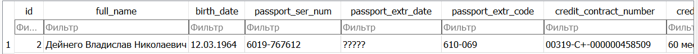

# WhatsApp-Bot
WA Bot parsing personal/credit documents to generate reports and contracts    
*Bot is currently disabled due to Meta politics, but generative part is stable*
## Install dependencies

Install "Tesseract OCR" on your PC:   
Binaries for Windows: https://digi.bib.uni-mannheim.de/tesseract/?ref=nanonets.com
Install "SQLite DB Browser" to visualize database
Installer for windows: https://sqlitebrowser.org/dl/
```commandline
pip install -r requirements.txt
```

## Setup

Put images to directory ```PATH/TO/PROJECT/WhatsApp-Bot/data/```  
All side parameters set automatically

## Launch

```commandline
python -m main
```

## Result

1) Copy path to database: ```PATH/TO/PROJECT/WhatsApp-Bot/database.db```
2) Open "DB Browser (SQLite)":
3) Use 'File' -> 'Open DB' -> copied path to file

